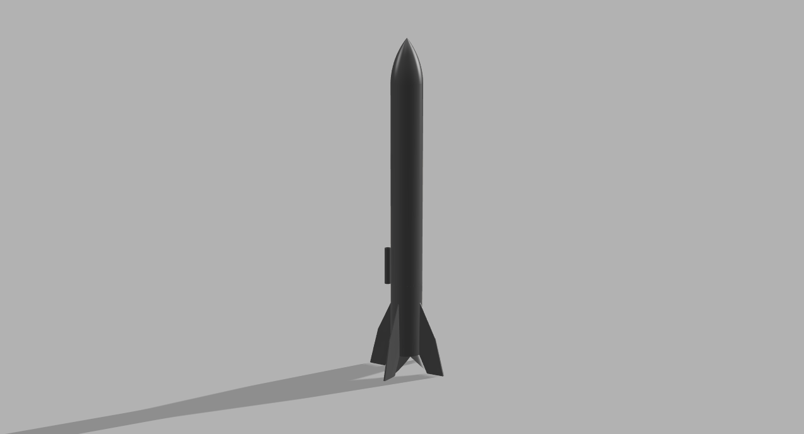
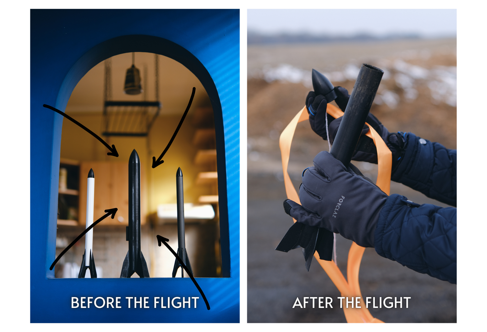
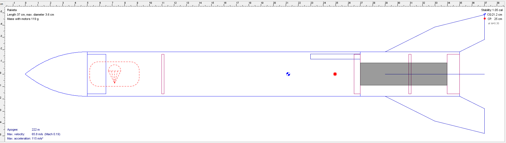
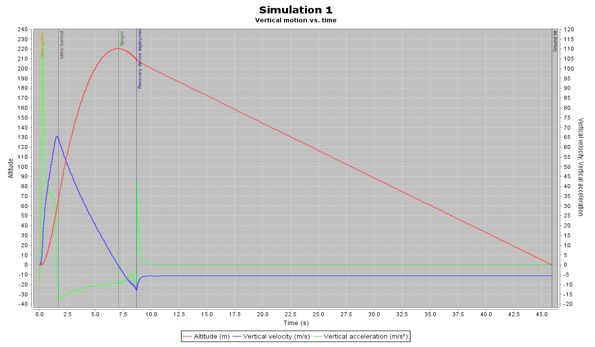

# Rocket A-1 - 3D printed flying model rocket

### ◾ About the project

**A-1** is a fully 3D-printable flying model rocket. It is threaded, so it doesn't require any glue to be assembled (except a little drop to attach the parachute or streamer cord to the cone (but I'll probably add a hook in the cone in incoming version to avoid this inconvenience)).

It is compatible with **Klima motors** (18mm diameter and 70mm length). It was tested with Klima C6-7 motor and flew nicely - the same model is ready to fly one more time.

Feel free to modify the model and create your own version best suited for your motor :). I'd love to see more A-1 fly!

### ◾ Files
This project consists of:
- `rocket_A-1.ork` file - rocket model and simulation created with [Open Rocket](http://openrocket.info/) software
- `Rocket A-1.f3d` file - rocket 3D printable model created in Autodesk Fusion 360
- `3D_printable_components` folder with three parts in `*.stl` format, ready to be printed

### ◾ How high will it fly?
- Simulation from the OpenRocket (included below) shows something about 220m. I didn't put the altimeter inside **yet**, but I guess it could have been something around it.

- So just give it a try...
- ...or see how it takes off in action:

  

### ◾ 3D printer hints
1. I printed the rocket on Ender 5 Pro. There's a possibility that your printer will require some adjustments in `*.stl` files to be able to print them properly.
2. It's good to use quite a big brims while printing fins - unfortunately they are quite likely to collapse and create not-so-nice PLA spaghetti 😬
3. I used PLA to print it, but ABS should be fine too. The rocket survived its first flight and it's getting ready for the next one, so PLA seems to be tough enough :).

### ◾ Known issues
1. The nose cone lacks a hook to attach the cord from the parachute or streamer, so it's unavoidable to use a bit of glue.
2. Launch lug should be placed on the bottom component, between two fins (not on the middle component).