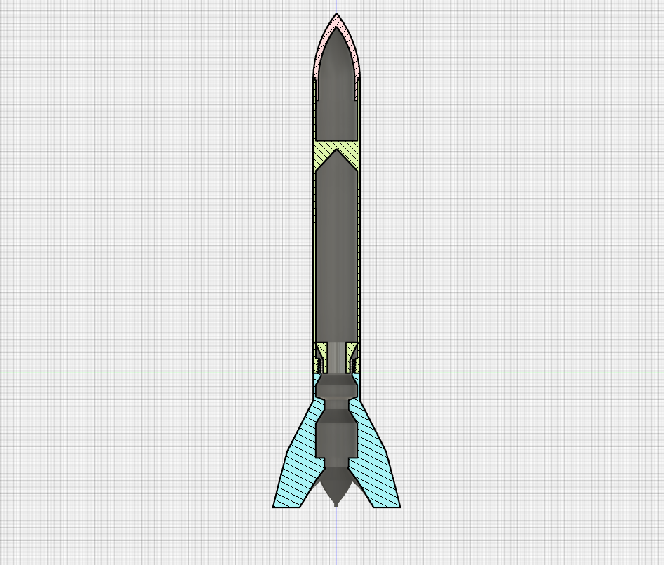

# Rocket A-1 - 3D printed flying model rocket

### ◾ About the project

**A-1** is a fully 3D-printable flying model rocket. It is threaded, so it doesn't require any glue to be assembled (except a little drop to attach the parachute or streamer cord to the cone (but I'll probably add a hook in the cone in incoming version to avoid this inconvenience)).

It is compatible with **Klima motors** (18mm diameter and 70mm length). It was tested with Klima C6-7 motor and flew nicely. 

Feel free to modify the model and create your own version best suited for your motor :). I'd love to see more A-1 fly!

### ◾ Files
This project consists of:
- `rocket_A-1.ork` file - rocket model and simulation created with [Open Rocket](http://openrocket.info/) software
- `Rocket A-1.f3d` file - rocket 3D printable model created in Autodesk Fusion 360
- `3D_printable_components` folder with three parts in `*.stl` format, ready to be printed

### ◾ How high will it fly?

### ◾ Hints
1. I printed the rocket on Ender 5 Pro. There's a possibility that your printer will require some adjustments in `*.stl` files to be able to print them properly.
2. It's good to use quite a big brims while printing fins - they like to collapse 😬

